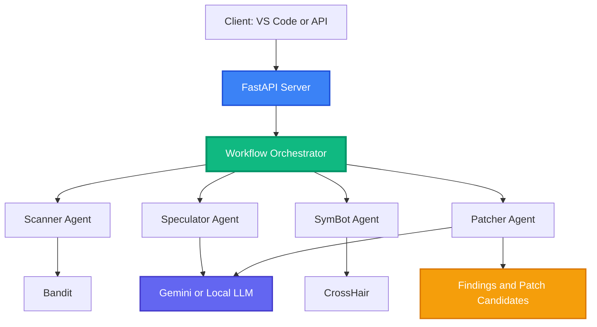
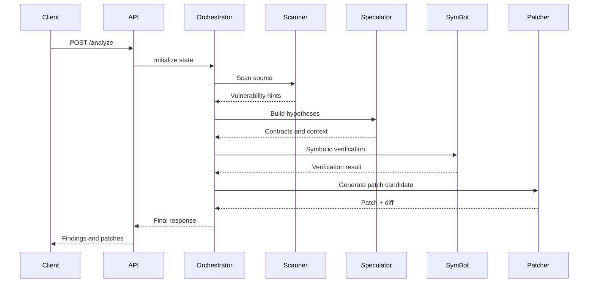

<div align="center">

# SecureCodeAI

### Multi-agent vulnerability detection and patch generation for Python code

Stop manually hunting security issues. Submit code, get prioritized vulnerabilities, verification feedback, and patch candidates.

[](README.md)
[](LICENSE)
[](https://www.python.org/)
[](https://fastapi.tiangolo.com/)
[](https://www.langchain.com/langgraph)
[](https://deepwiki.com/Keerthivasan-Venkitajalam/secure-code-ai)

[About](#about-the-project) | [Architecture](#system-architecture) | [Agent Flow](#the-4-stage-agent-flow) | [Getting Started](#getting-started) | [API](#api-reference) | [Security](#security)

</div>

---

## Table of Contents

- [About the Project](#about-the-project)
- [System Architecture](#system-architecture)
- [The 4-Stage Agent Flow](#the-4-stage-agent-flow)
- [Tech Stack](#tech-stack)
- [Getting Started](#getting-started)
- [Configuration](#configuration)
- [API Reference](#api-reference)
- [Security](#security)
- [Project Structure](#project-structure)
- [Troubleshooting](#troubleshooting)
- [Developers](#developers)
- [Contributing](#contributing)
- [Reference Docs](#reference-docs)

---

## About the Project

SecureCodeAI combines static analysis, LLM reasoning, and symbolic execution to help teams find and patch security issues faster.

### What it does

- Detects likely vulnerabilities in source code
- Searches a bug-pattern knowledge base using semantic similarity
- Runs specialized validators (hardware, lifecycle, API typo)
- Generates formal hypotheses and verification context
- Runs symbolic checks to validate findings
- Produces patch candidates with reviewable diffs

### Why this exists

Security review often stalls between detection and remediation. SecureCodeAI is designed to shorten that loop with an agent pipeline that can reason, verify, and propose concrete fixes.

---

## System Architecture

Code comes from editor or API client, enters FastAPI, flows through an orchestrator, and then through specialized agents.



### Core Components

| Component | Responsibility |
|-----------|----------------|
| Scanner Agent | Initial SAST and code-slice extraction |
| Semantic Scanner | RAG-based pattern matching from knowledge base |
| Validator Suite | Hardware/lifecycle/API typo checks |
| Speculator Agent | Security hypothesis and contract generation |
| SymBot Agent | Symbolic validation and counterexample checks |
| Patcher Agent | Patch synthesis and iterative refinement |
| Orchestrator | State transitions and execution control |

---

## The 4-Stage Agent Flow

### Stage 1: Scan

- Parse code and run static checks
- Identify likely vulnerability hotspots

### Stage 2: Speculate

- Generate formalized vulnerability hypotheses
- Add context for validation and patching

### Stage 3: Verify

- Execute symbolic analysis with CrossHair
- Confirm, reject, or refine vulnerability claims

### Stage 4: Patch

- Generate patch candidates
- Re-run validation loop until criteria are met or iteration limit is reached



---

## Tech Stack

### Core Runtime

| Tech | Purpose |
|------|---------|
| Python 3.10+ | Core implementation |
| FastAPI | API service layer |
| LangGraph | Agent workflow orchestration |
| Pydantic | Request/response validation |

### Security and Analysis

| Tech | Purpose |
|------|---------|
| Bandit | Static security checks |
| CrossHair | Symbolic verification |
| LangChain ecosystem | LLM integration support |

### Deployment and Tooling

| Tech | Purpose |
|------|---------|
| Docker / Compose | Local and production deployment |
| pytest | Testing |
| Ruff / Black / isort | Code quality and formatting |

---

## Getting Started

### Prerequisites

- Python 3.10+
- Docker Desktop (recommended)
- 8 GB RAM minimum (16 GB+ recommended for local model workflows)

### Option A: Docker (recommended)

```bash
cd secure-code-ai/deployment
cp .env.example .env
# edit .env with your backend settings

docker-compose up -d
curl http://localhost:8000/health
```

### Option B: Helper scripts

Windows PowerShell:

```powershell
cd secure-code-ai
.\scripts\start_local.ps1
```

Linux/macOS:

```bash
cd secure-code-ai
./scripts/start_local.sh
```

### Option C: Native Python runtime

```bash
cd secure-code-ai
python -m venv venv
source venv/bin/activate
pip install -r requirements.txt

export SECUREAI_USE_GEMINI=true
export SECUREAI_GEMINI_API_KEY=your_key_here
python -m uvicorn api.server:app --host 127.0.0.1 --port 8000 --reload
```

### VS Code Extension

```bash
cd secure-code-ai/extension
npm install
npm run compile
```

Configure endpoint:

```json
{
  "securecodai.apiEndpoint": "http://localhost:8000"
}
```

---

## Configuration

Copy [deployment/.env.example](deployment/.env.example) to `.env` and set values for your environment.

| Variable | Description |
|----------|-------------|
| `SECUREAI_USE_GEMINI` | Use Gemini cloud backend |
| `SECUREAI_USE_OLLAMA` | Use Ollama backend |
| `SECUREAI_OLLAMA_MODEL` | Ollama model name |
| `SECUREAI_OLLAMA_URL` | Ollama server URL |
| `SECUREAI_GEMINI_API_KEY` | Primary Gemini key env var |
| `GEMINI_API_KEY` | Compatibility fallback key |
| `SECUREAI_USE_LOCAL_LLM` | Enable local model backend |
| `SECUREAI_MODEL_PATH` | Local model path |
| `SECUREAI_ENABLE_SEMANTIC_SCANNING` | Enable semantic bug detection |
| `SECUREAI_KNOWLEDGE_BASE_PATH` | Path to knowledge base CSV |
| `SECUREAI_VECTOR_STORE_PATH` | Path to vector store directory |
| `SECUREAI_SIMILARITY_THRESHOLD` | Similarity threshold for pattern matches |
| `SECUREAI_TOP_K_RESULTS` | Maximum semantic matches returned |
| `SECUREAI_MAX_ITERATIONS` | Patch loop limit |
| `SECUREAI_SYMBOT_TIMEOUT` | Symbolic execution timeout |
| `SECUREAI_RATE_LIMIT_REQUESTS` | Per-minute request limit |
| `SECUREAI_ENABLE_DOCS` | Enable Swagger/ReDoc endpoints |

---

## API Reference

### Core Endpoints

- `POST /analyze` - Analyze code and return vulnerabilities and patch candidates
- `POST /search_similar` - Search similar bug patterns in the knowledge base
- `GET /knowledge_base/stats` - Get knowledge base statistics
- `GET /health` - Liveness and health status
- `GET /health/ready` - Readiness for traffic
- `GET /docs` - Swagger docs (when enabled)
- `GET /redoc` - ReDoc docs (when enabled)

### Analyze Request

```json
{
  "code": "query = f\"SELECT * FROM users WHERE username='{username}'\"",
  "file_path": "app/database.py",
  "max_iterations": 3
}
```

### Analyze Response Shape

```json
{
  "analysis_id": "uuid",
  "vulnerabilities": [],
  "patches": [],
  "semantic_vulnerabilities": [],
  "hardware_violations": [],
  "lifecycle_violations": [],
  "api_typo_suggestions": [],
  "execution_time": 0.0,
  "errors": [],
  "logs": [],
  "workflow_complete": true
}
```

---

## Security

- Use environment variables for secrets and credentials
- Keep service account files under ignored directories only
- Set explicit CORS origins in production
- Keep API docs disabled on public internet if not needed
- Rotate keys immediately if exposure is suspected

---

## Project Structure

```text
secure-code-ai/
+-- agent/          # Agent graph and node implementations
+-- api/            # FastAPI server, config, and orchestration
+-- deployment/     # Dockerfiles, compose, and deployment docs
+-- extension/      # VS Code extension
+-- scripts/        # Startup and deployment scripts
+-- tests/          # Unit and integration tests
+-- benchmarks/     # Evaluation utilities
`-- examples/       # Example vulnerable code snippets
```

---

## Troubleshooting

| Problem | Fix |
|---------|-----|
| Service not reachable | Check `docker-compose logs -f` and verify port 8000 |
| 429 rate limit errors | Increase `SECUREAI_RATE_LIMIT_REQUESTS` for trusted clients |
| Missing dependencies | Re-run `pip install -r requirements.txt` |
| Extension cannot connect | Verify `securecodai.apiEndpoint` and API health |

---

## Developers

1. Ansh Raj Rath - [@AnshRajRath](https://github.com/AnshRajRath)
2. Aditya Krishna Samant - [@Supersamant23](https://github.com/Supersamant23)
3. Keerthivasan S V - [Keerthivasan-Venkitajalam](https://github.com/Keerthivasan-Venkitajalam)
4. Krish S - [@krish-subramoniam](https://github.com/krish-subramoniam)
5. Tamarana Rohith Balaji - [@T-ROHITH-BALAJI](https://github.com/T-ROHITH-BALAJI)

---

## Contributing

1. Fork the repository
2. Create a branch (`git checkout -b feat/your-change`)
3. Add or update tests
4. Run formatting and checks
5. Open a pull request

---

## Reference Docs

- [SETUP.md](SETUP.md)
- [ARCHITECTURE.md](ARCHITECTURE.md)
- [LLM_AGENT_ARCHITECTURE.md](LLM_AGENT_ARCHITECTURE.md)
- [MULTI_LLM_ARCHITECTURE.md](MULTI_LLM_ARCHITECTURE.md)
- [SEMANTIC_SCANNING_GUIDE.md](SEMANTIC_SCANNING_GUIDE.md)
- [KNOWLEDGE_BASE_MANAGEMENT.md](KNOWLEDGE_BASE_MANAGEMENT.md)
- [SCRIPTS_REFERENCE.md](SCRIPTS_REFERENCE.md)
- [deployment/README.md](deployment/README.md)
- [EXTENSION_GUIDE.md](EXTENSION_GUIDE.md)
- [extension/README.md](extension/README.md)
- [QUICKSTART.md](QUICKSTART.md)
- [LOAD_TESTING.md](LOAD_TESTING.md)

---

<div align="center">

SecureCodeAI

</div>
